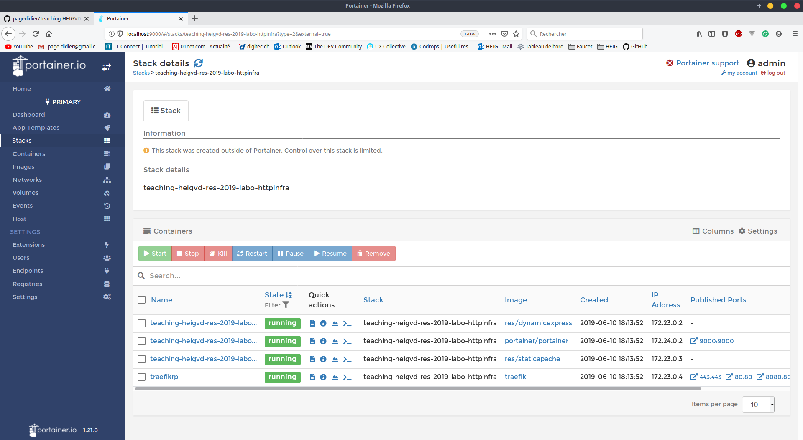

# Teaching-HEIGVD-RES-2019-Labo-HTTPInfra

**<u>authors :</u>** Legrand Bruno, Page Didier Dominique

*June the 9th, 2019*

## Foreword

This report is a summary of the laboratory HTTPInfra which take place in *RES* course at the *heig-vd*. All steps are explained and the content of the work is located in several *git* branches.

## Step 1: Static HTTP server with apache httpd

The content of this step is in branch `feature/apache-docker`.

Firstly we built our Docker image for *apache 2* and *php* with our  own custom *HTTP* content. This content  derived from https://startbootstrap.com/themes/.

The corresponding *Dockerfile* is in the folder `docker-apache-image/`. Thanks to it we can build docker images with the expected *HTTP* static content.

```dockerfile
# download the last stable version of php that include apache2
FROM php:7.2-apache

# copy the static content
COPY ./src /var/www/html/

# debug purpose
RUN apt update && apt install -y vim
```

To build and run *dockerised* apache php server use the commands below.

```bash
$ cd docker_apache_image/
$ docker build -t res/apache_php .
$ docker run --rm --name apache_php -d -p 80:80 res/apache_php:latest  
```

Then access the server on <u>port 80</u>.


## Step 2: Dynamic HTTP server with express.js

The content of this step is in branch `feature/express-docker`.

The purpose of *node* application is to mock a weather service.  The server is going to generate random number and name to produce fake cities, coordinates, temperatures and precipitations. It is going to send a *JSON* array of couples city-weekMeteo. 

Note that we used several node modules. 

- chance is used to generate random data
- express is minimalist, flexible and fast Web infrastructure
- cors provide a [Connect](http://www.senchalabs.org/connect/)/[Express](http://expressjs.com/) middle ware that can be used to enable [CORS](http://en.wikipedia.org/wiki/Cross-origin_resource_sharing) with various options.
- http-errors is used to create HTTP errors for Express

To install them run `npm install`.

```javascript
require('dotenv').config();
const cors = require('cors');
const createError = require('http-errors');
const express = require('express');

const Chance = require('chance');

const chance = new Chance();

const configFile = require('./config/config.json');

const environment = process.env.NODE_ENV || 'dev';
const config = configFile[environment];


const { port } = config;

const app = express();

app.use(express.json());


app.use((req, res, next) => {
  res.header('Access-Control-Allow-Origin', '*');
  res.header(
    'Access-Control-Allow-Headers',
    'Origin, X-Requested-With, Content-Type, Accept, Authorization',
  );
  if (req.method === 'OPTIONS') {
    res.header('Access-Control-Allow-Methods', 'PUT, POST, PATCH, DELETE, GET');
    return res.status(200).json({});
  }
  next();
});


app.use(cors());


app.get('/api/meteo', (req, res) => {
  const data = [];
  for (let i = 0; i < 10; i += 1) {
    const cityname = chance.city();
    const citylat = chance.latitude();
    const citylong = chance.longitude();

    const city = {
      cityname,
      citylat,
      citylong,
    };
    const weekMeteo = [];
    for (let j = 0; j < 7; j += 1) {
      const temperature = chance.integer({ min: 0, max: 40 });
      const precipitation = chance.integer({ min: 0, max: 10 });
      weekMeteo.push({ temperature, precipitation });
    }
    const elem = {
      city,
      weekMeteo,
    };

    data.push(elem);
  }
  res.json(data);
});

app.use((req, res, next) => {
  next(createError(404));
});


app.use((error, req, res, next) => {
  res.status(error.status || 500);
  res.json({ error: true, message: error.message });
});


app.listen(port);
module.exports = app;
```


Once our app works we can begin to *dockerised* it. In the same way as step 1 we built and run our docker image with our own content.

```dockerfile
# download the last version of node
FROM node:10.16

# copy the dynamic content
WORKDIR /opt/app
COPY src /opt/app

# run node server
CMD ["npm","start"]
```

Note that <u>Express framework default port is 3000</u>.

```bash
$ cd docker_express_image/
$ docker build -t res/express .
$ docker run --rm --name express -d -p 3030:3000 res/apache_php:latest  
```


Note that you had to specified the resource which is `api/meteo` otherwise you will get an *JSON* error message. 

Getting the right resource the server is sending to us *JSON* array containing fake weather data.

  

## Step 3: Reverse proxy with apache (static configuration)

The content of this step is in branch `feature/RP-docker`. 

Firstly we run two containers and get their IP addresses. :

- Apache 2 & PHP which provide static content

  ```bash
  $ docker run --rm --name apache_php -d res/apache_php:latest
  $ docker inspect apache_php 
  ...
                      "IPAddress": "172.0.24.2",
  ...
  
  ```

  

- Node JS - Express which provide dynamic content

  ```bash
  $ docker run --rm --name express -d res/express:latest
  $ docker inspect express 
  ...
                      "IPAddress": "172.0.24.1",
  ...
  
  ```

Then we can make the hard coded configuration for the reverse proxy apache server. Note that containers <u>have to be run in a particular order</u> to get this configuration. 

1. apache & PHP
2. Node JS Express

Our laboratory group have Linux as operation system and we check the two containers with a third one executing telnet.

<u>000-default.conf</u>

```
<VirtualHost *:80>
<VirtualHost>
```

<u>001-reverse-proxy.conf</u>

```
<VirtualHost *:80>
    ServerName demo.res.ch

    ProxyPass "/api/" "http://172.0.24.1:3000/"
    ProxyPassReverse "/api/" "http://172.0.24.1:3000/"

    ProxyPass "/" "http://172.0.24.2:80/"
    ProxyPassReverse "/" "http://172.0.24.2:80/"
<VirtualHost>
```

After we get the desired configuration we write the Dockerfile.

```dockerfile
# download the last version of apache
FROM php:7.2-apache

# copy the configuration files
COPY conf/ /etc/apache2

# enable proxy
RUN a2enmod proxy proxy_http

# enable sites
RUN a2ensite 000-* 001-*
```

```bash
$ docker build -t res/apache_rp .
$ docker run --rm --name rp -d -p 80:80 res/apache_rp:latest
```

Throw this reverse proxy we can access the two HTTP severs.

```bash
# dynamic content
# Warning every other path
telnet localhost 80

GET /api/ HTTP/1.0
Host: demo.res.ch

...

# static content
telnet localhost 80

GET / HTTP/1.0
Host: demo.res.ch
```

To get this working from browser you have to add `localhost demo.res.ch` to your hosts.


// ---------------------------- capture du reverse proxy qui fonctionne ----------------------------

## Step 4: AJAX requests with JQuery

The content of this step is in branch `feature/express-docker`.

In this part we modify static content to execute AJAX request on Express server to update the static content.


Firstly we modify all our *Dockerfile* to make vim installed on all our custom docker image.  Just add the following line into each *Dockerfile*.

```dockerfile
RUN apt update && apt install -y vim
```

Do not forget to rebuild all images before run containers.

Then we modify the static content (in our case it is `index.html`) to add some JavaScript.

```javascript
Mettre une fonction javascript
```

This function is used to update ----------- Un champ de la page html + quelques explications ------------.


## Step 5: Dynamic reverse proxy configuration

The content of this step is in branch `feature/RP-dynamic`.

First of all we created the php scirpt for building our apache configuration file

```php
<?php

$dynamic_app = getenv("dynamic_app");
$static_app = getenv("static_app");
?>

<VirtualHost *:80>
    ServerName reslab

    ProxyPass '/api/' 'http://<?= $dynamic_app ?>/'
    ProxyPassReverse '/api/' 'http://<?= $dynamic_app ?>/'

    ProxyPass '/' 'http://<?= $static_app ?>/'
    ProxyPassReverse '/' 'http://<?= $static_app ?>/'
</VirtualHost>


```

We had some problems with the `ServerName` in the last part so we change it.
when we entered `demo.res.ch` in a browser, it automatically want to search website on internet.

So to prevent that we change the name to a simpler one : `reslab`

As in the webcast, we downloaded the `apache2-foreground` file that we added the line :

```bash
php /var/apache2/templates/config-template.php > /etc/apache2/sites-available/001-reverse-proxy.conf
```

Then we created a bash script to build, configure and start our infrastructure.

First in the script we define our image and container name

```bash
staticContainerImage=res/static_image
dynamicContainerImage=res/dynamic_image
rpContainerImage=res/rp_image

staticContainerName=static_app
dynamicContainerName=dynamic_app
rpContainerName=rp_app
```

Then just a fiew line to stop old running container with the same name

```bash
docker stop $staticContainerName
docker stop $dynamicContainerName
docker stop $rpContainerName

docker rm $staticContainerName
docker rm $dynamicContainerName
docker rm $rpContainerName
```

Then we build the images 

```bash
cd ..
cd docker-apache-image
docker build . -t $staticContainerImage

cd ..
cd docker-express-image
docker build . -t $dynamicContainerImage

cd ..
cd docker-apache-RP
docker build . -t $rpContainerImage
```

Next we run the static and dynamic service

```bash
docker run -d --name $staticContainerName $staticContainerImage
docker run -d --name $dynamicContainerName $dynamicContainerImage
```

And noe the magic part :

We inspecte by the name, the botth services to get their ip adresses

```bash
ipstatic=$(docker inspect -f '{{range .NetworkSettings.Networks}}{{.IPAddress}}{{end}}' $staticContainerName)
ipdynamic=$(docker inspect -f '{{range .NetworkSettings.Networks}}{{.IPAddress}}{{end}}' $dynamicContainerName)

```

And at the wnd we start our reverse proxy contaienr with the environment variables

```bash
docker run -d -e $staticContainerName=$ipstatic:80 -e $dynamicContainerName=$ipdynamic:3000 -p 80:80 --name $rpContainerName $rpContainerImage

```


## Additional steps

All configuration In theses steps are in the branch `traefik`. To simplify the configuration of the used tools, we created a docker-compose.yml file and set our infrastructure to use it.

```
version: "3"
services:
  static-apache:
    image: res/staticapache
    build:
      context: ./docker-apache-image
      dockerfile: Dockerfile
    expose:
      - "80"
  dynamic-express:
    image: res/dynamicexpress
    build:
      context: ./docker-express-image
      dockerfile: Dockerfile
    expose:
      - "3000" 

```

And for the next steps we use the traefik reverse proxy that support the load balancing, the sticky sessions and the dynamic cluster managment

We installed it by adding the default configuration in the docker-compose file

```yml
  rp:
    image: traefik
    container_name: traefikrp
    restart: always
    command: --api --docker
    ports:
      - "80:80"
      - "443:443"
      - "8080:8080"
    volumes:
      - /var/run/docker.sock:/var/run/docker.sock:ro
      - ./traefik.toml:/traefik.toml
      - ~/data/traefik/acme.json:/acme.json
    networks:
      - web
      
networks:
  web:
    external: true      
```

And set the label to our configuation to support traefik.

To the static service

```yml
    labels:
      - "traefik.docker.network=web"
      - "traefik.frontend.rule=Host:localhost"
      - "traefik.port=80"
      - "traefik.backend.loadbalancer.stickiness=true"
      - "traefik.backend.loadbalancer.stickiness.cookieName=stickyCookie" 
    networks:
      - web
```

Here is the configuration to the sticky session and the load balancing.

If we start our infrastructure and check in the network tab in dev tool fom the browser we see a cookie for the session.


to the dynamic service

```yml
    labels:
     - "traefik.docker.network=web"
     - "traefik.frontend.rule=Host:localhost; PathPrefixStrip:/api"
     - "traefik.port=3000"
```

So if we run the the command to upscale the dynamic service :

```bash
docker-compose scale dynamic-express=3
```


We can see that we have 3 instances of the node server.

We can also up scale our static web site


### Management UI  

For the management UI we instelled and used the tool `portainer` 

The installation is set by adding a new service in the docker compose file

```yml
  portainer:
      image: portainer/portainer
      command: -H unix:///var/run/docker.sock
      restart: always
      ports:
          - 9000:9000
      volumes:
          - /var/run/docker.sock:/var/run/docker.sock
          - portainer_data:/data

volumes:
    portainer_data:
```

So now we can manage our lab througth the web interface on `localhost:9000`


## 

## Sources

https://www.npmjs.com/package/cors

https://expressjs.com/fr/

https://startbootstrap.com/themes/

https://www.npmjs.com/package/http-errors